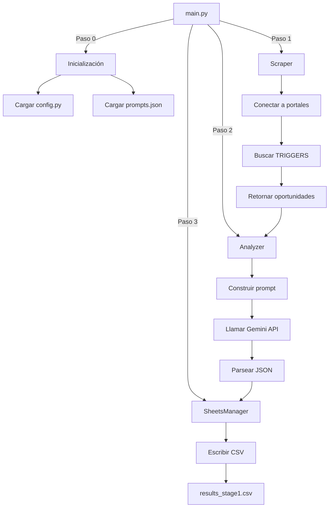

# MIA V4.0 - DOCUMENTACIÓN DE ETAPAS 0 Y 1

## 📋 Resumen General

Este documento proporciona una guía completa de la documentación agregada a los archivos Python y JSON de las **Etapas 0 (Configuración) y 1 (Scraping y Análisis)** del sistema MIA V4.0.

---

## 🎯 Objetivo de la Documentación

Se han agregado **comentarios explicativos detallados en español** a todos los módulos para:

1. ✅ Comprender el **objetivo** de cada módulo
2. ✅ Entender cada **sección** del código
3. ✅ Clarificar cada **acción** y su propósito
4. ✅ Facilitar el **mantenimiento** futuro
5. ✅ Ayudar a nuevos desarrolladores a entender el sistema

---

## 📁 Archivos Documentados

### **ETAPA 0: CONFIGURACIÓN**

#### 1. `src/config.py`
**Propósito:** Centralizar toda la configuración del sistema

**Secciones documentadas:**
- ⚙️ Configuración de Gemini AI (modelo y API key)
- 🌐 Lista de portales (PORTALS)
  - Group 1 activo (3 portales)
  - Groups 2-8 comentados para futuro
- 🔑 Palabras clave de oportunidades (TRIGGERS)
  - 18 triggers activos en 5 categorías
- 🏷️ Keywords de rubros específicos (SEARCH_KEYWORDS)
  - Solo "agua" activo actualmente
- 📊 Rubros detallados (RUBROS - comentado)
  - 8 rubros con keywords técnicas

**Comentarios agregados:**
```python
# Encabezado docstring completo
# Comentarios por sección
# Explicación de cada portal
# Categorización de triggers
# Notas sobre estado actual vs futuro
```

#### 2. `config/prompts.json`
**Propósito:** Plantillas de prompts para Gemini AI

**Documentación agregada:**
- 📝 Comentarios generales (usando campos `_comentario_*`)
- 📖 Descripción extendida del prompt
- 🔧 Explicación de variables dinámicas
- 📋 Notas técnicas sobre:
  - Truncamiento de texto
  - Formato de respuesta esperado
  - Idioma y enfoque del análisis
- 📊 Descripción detallada del formato de salida

---

### **ETAPA 1: SCRAPING Y ANÁLISIS**

#### 3. `main.py`
**Propósito:** Punto de entrada principal del sistema

**Secciones documentadas:**
- 📌 Encabezado docstring completo con:
  - Objetivo general
  - Etapas del proceso
  - Componentes principales
  - Flujo de ejecución
  - Archivos de salida
- 🔧 Configuración del sistema de logging
- 🎯 Función principal `main()`:
  - Paso 0: Inicialización de componentes
  - Paso 1: Scraping de portales
  - Paso 2: Análisis con IA
  - Paso 3: Almacenamiento de resultados
- ⚠️ Manejo de errores y finalización

#### 4. `src/scraper.py`
**Propósito:** Búsqueda automatizada en portales web

**Secciones documentadas:**
- 📌 Encabezado docstring con:
  - Objetivo y funcionamiento
  - Configuración requerida
  - Estructura de salida
  - Limitaciones actuales
- 🏗️ Clase `Scraper`:
  - Constructor con carga de configuración
  - Método `search_all()` - escaneo de todos los portales
  - Método `scan_portal()` - escaneo individual
  - Detección de palabras clave
  - Manejo de errores de conexión

#### 5. `src/analyzer.py`
**Propósito:** Análisis con Inteligencia Artificial (Gemini)

**Secciones documentadas:**
- 📌 Encabezado docstring con:
  - Objetivo del análisis
  - Entrada y salida esperada
  - Configuración requerida
  - Dependencias
- 🤖 Clase `Analyzer`:
  - Constructor con configuración de Gemini API
  - Método `_load_prompt_template()` - carga de plantilla
  - Método `analyze_opportunity()` - análisis principal
  - Preparación del prompt
  - Llamada a Gemini API
  - Limpieza y parseo de respuesta JSON
  - Manejo de errores

#### 6. `src/sheets_manager.py`
**Propósito:** Gestión de salida de datos (CSV/Google Sheets)

**Secciones documentadas:**
- 📌 Encabezado docstring con:
  - Objetivo de gestión de salida
  - Funcionamiento actual
  - Estructura del CSV
  - Futuras funcionalidades
- 💾 Clase `SheetsManager`:
  - Constructor con verificación de credenciales
  - Método `add_row()` - agregar fila de datos
  - Método `_write_csv()` - escritura en CSV
  - Características del archivo CSV

---

## 🔍 Tipos de Comentarios Agregados

### 1. **Docstrings de Módulo**
Encabezado completo al inicio de cada archivo `.py`:
```python
"""
================================================================================
MIA V4.0 - MÓDULO [NOMBRE] ([archivo].py)
================================================================================

OBJETIVO GENERAL:
    [Descripción del propósito del módulo]

ETAPA: [0/1/2/3]

FUNCIONAMIENTO:
    [Pasos del proceso]

...
================================================================================
"""
```

### 2. **Docstrings de Clase**
Documentación de cada clase:
```python
class NombreClase:
    """
    [Descripción de la clase]
    
    RESPONSABILIDADES:
        - [Lista de responsabilidades]
    """
```

### 3. **Docstrings de Método**
Documentación de cada método:
```python
def metodo(self, parametro):
    """
    [Descripción del método]
    
    PARÁMETROS:
        parametro (tipo): [Descripción]
    
    RETORNO:
        [Descripción del retorno]
    """
```

### 4. **Comentarios de Sección**
Separadores visuales para secciones importantes:
```python
# ============================================================================
# SECCIÓN PRINCIPAL
# ============================================================================
```

### 5. **Comentarios Inline**
Explicaciones línea por línea para código complejo:
```python
self.triggers = [t.lower() for t in TRIGGERS]  # Keywords en minúsculas
```

---

## 📊 Estructura del Sistema MIA V4.0

```
MIA V4.0/
│
├── ETAPA 0: CONFIGURACIÓN
│   ├── src/config.py          ← Configuración centralizada
│   └── config/prompts.json    ← Plantillas de prompts IA
│
├── ETAPA 1: SCRAPING
│   └── src/scraper.py         ← Búsqueda en portales web
│
├── ETAPA 2: ANÁLISIS
│   └── src/analyzer.py        ← Análisis con Gemini AI
│
├── ETAPA 3: ALMACENAMIENTO
│   └── src/sheets_manager.py  ← Salida a CSV/Sheets
│
└── ORQUESTADOR
    └── main.py                ← Coordinador principal
```

---

## 🚀 Flujo de Ejecución Documentado



---

## 📝 Convenciones de Documentación

### Idioma
- ✅ **Todos los comentarios en ESPAÑOL**
- ✅ Términos técnicos en inglés cuando sea estándar (JSON, API, CSV)

### Formato
- ✅ Encabezados con líneas de `=` (80 caracteres)
- ✅ Secciones con líneas de `-` (72 caracteres)
- ✅ Indentación consistente (4 espacios)

### Contenido
- ✅ **OBJETIVO**: Qué hace el módulo/función
- ✅ **PROCESO**: Cómo lo hace (pasos)
- ✅ **ENTRADA**: Qué recibe
- ✅ **SALIDA**: Qué retorna
- ✅ **ESTADO ACTUAL**: Qué está implementado
- ✅ **FUTURO**: Qué se planea agregar

---

## 🎓 Guía de Lectura Recomendada

Para entender el sistema completo, leer en este orden:

1. **`DOCUMENTACION_ETAPAS_0_1.md`** (este archivo) - Visión general
2. **`src/config.py`** - Configuración del sistema
3. **`main.py`** - Flujo principal de ejecución
4. **`src/scraper.py`** - Cómo se buscan oportunidades
5. **`src/analyzer.py`** - Cómo se analizan con IA
6. **`config/prompts.json`** - Qué se le pide a Gemini
7. **`src/sheets_manager.py`** - Cómo se guardan resultados

---

## 🔧 Mantenimiento y Modificaciones

### Para modificar portales:
📍 Editar: `src/config.py` → sección `PORTALS`

### Para modificar triggers:
📍 Editar: `src/config.py` → sección `TRIGGERS`

### Para modificar análisis IA:
📍 Editar: `config/prompts.json` → campo `template`

### Para modificar columnas CSV:
📍 Editar: `src/sheets_manager.py` → variable `fieldnames`

---

## ✅ Checklist de Documentación Completada

- [x] `main.py` - Módulo principal
- [x] `src/config.py` - Configuración
- [x] `src/scraper.py` - Scraping
- [x] `src/analyzer.py` - Análisis IA
- [x] `src/sheets_manager.py` - Salida de datos
- [x] `config/prompts.json` - Plantillas de prompts
- [x] `DOCUMENTACION_ETAPAS_0_1.md` - Este documento

---

## 📞 Contacto

**Proyecto:** MIA V4.0 - Monitor de Inteligencia de Adquisiciones  
**Empresa:** Water Tech S.A.  
**Versión:** 4.0 - Stage 1  
**Fecha de Documentación:** Diciembre 2025

---

## 📄 Licencia

Documentación interna de Water Tech S.A.  
Todos los derechos reservados.
